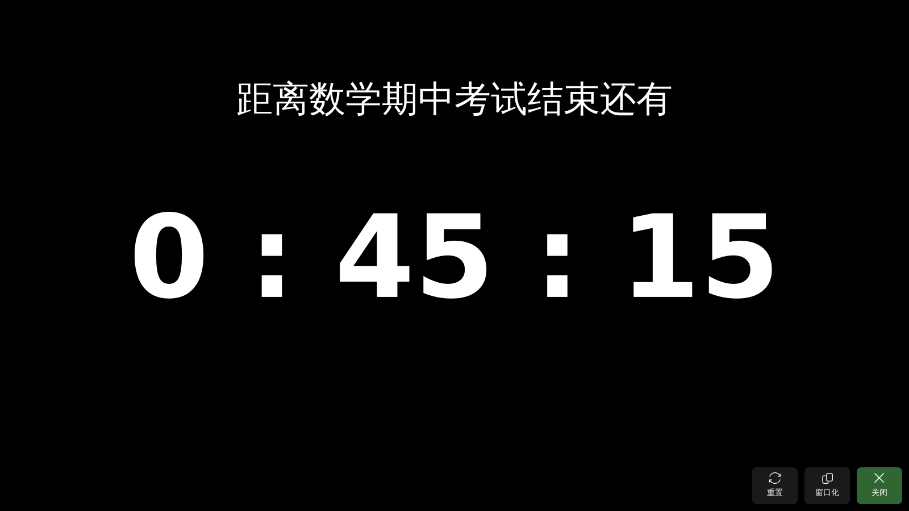

> [!IMPORTANT]
> 欢迎加入 电教猫 Pro 交流群：[767989508](https://qm.qq.com/q/dRO0BOMvmM)

<div align="center">


# 电教猫 Pro 5

<sub>DJCat Pro 5</sub>

## 为电教工作提效增色

[![Release][release-shield]][release-url]
[![License][license-shield]][license-url]
[![QQGroup][qq-shield]][qq-url]

##### [下载最新版][release-url] · [更新日志][releases-url] · [反馈问题][issues-url] · [交流群][qq-url]

</div>

## 功能亮点

* **一句话也能上大屏。** 全屏投送支持纯文本和 Markdown，还能让 AI 把随手写的通知整理成排版好的文字。可以全屏，也可以缩成窗口放在一边；程序意外退出后，下次启动自动恢复投送。
* **考试就交给它。** 考试倒计时大字显示剩余时间，临近结束有语音提醒；另有全屏时钟，课间一键挂上。
* **到点自己干活。** 定时播报、自动任务、定时关机。自动任务既能按时间触发，也能在电教猫启动、静默启动、退出时触发，打开功能、执行自定义动作或关掉投送都行。
* **主页你说了算。** 自定义卡片可以把打开程序、网页、文件夹、执行命令、延时串成一组动作，一点全做完。常用卡片还能固定到托盘菜单，不开主窗口也能用。
* **常用软件一站装齐。** 应用市场收录适合班级大屏的软件，一键下载、安装、更新和打开，装好的应用也能固定到主页。
* **每个细节都能调。** 投送、倒计时和全屏时钟的背景（跟随主题、纯色或图片）、角落按钮位置、置顶与窗口化都能单独设置；软件图标、窗口标题、托盘提示文字也能换成你的。设置页带实时预览，还能直接搜索。
* **为电教机房打磨。** 默认便携模式，数据跟着程序走，不怕冰点还原；支持应用内更新、托盘常驻，触控大屏上滑动和点按互不误触。

## 关于项目

电教猫最早叫"250 安全卫士"，用 VB6.0 编写：当时教室大屏一打开希沃易课堂的推送功能电脑就会崩溃，它负责拦截并警告老师。后来换了大屏，拦截不再需要，但当初脑子一热加进去的全屏投送却非常好用，于是去掉拦截、加上考试倒计时，改造成了"电教工具"。因为我和班主任都喜欢罗小黑，设计语言换成了罗小黑主题，并在 3.0 正式改名电教猫。

到了 电教猫 Pro 4.1，VB6.0 的维护成本和历史包袱都已经太重（核心代码里甚至还残留着 250 安全卫士 1.1 的代码），于是 电教猫 Pro 5 完全抛弃旧架构，用 Python + PySide6 + Fluent Widgets 全新重构，并加入 AI 辅助，让电教工作更高效。

<details>
<summary>版本演进</summary>

| 版本 | 变化 |
|:--|:--|
| 250 安全卫士 1.x | VB6.0 编写，拦截易课堂推送并警告老师；顺手加入全屏投送（当时只有正文和关闭按钮） |
| 电教工具 V2.9 | 去掉拦截功能，加入考试倒计时等功能 |
| 电教猫 3.0 | 采用罗小黑主题，正式改名电教猫 |
| 电教猫 Pro 3.x | 3.0 出了一些 bug，但没有重大功能，于是脑子一热改名 电教猫 Pro，此后不断优化更新 |
| 电教猫 Pro 4.0 / 4.1 | 加入定时关机，并用 VB6.0 模仿出各种操作的飞出提示条 |
| 电教猫 Pro 5 | Python + PySide6 + Fluent Widgets 全新重构，加入 AI 辅助 |

</details>

## 下载与系统要求

| 平台 | 系统版本 | 架构 |
|:--|:--|:--|
|  **Windows** | `10+` | `x86_64` |

> [!WARNING]
> Qt `6.6+` 不再支持没有 `AVX` 指令集的 CPU。

在 [Releases][release-url] 下载以下任意一种：

* **安装程序**（`Setup.exe`）：可创建开始菜单和桌面快捷方式，默认装在 D 盘（没有 D 盘时回退）。
* **免安装压缩包**（`.zip`）：解压即用。

两种形态全新使用时都默认便携模式，数据保存在程序旁的 `DJCatPro` 文件夹里。

> [!TIP]
> 学校电脑装了冰点还原之类的还原软件时，请把电教猫放在**不受还原保护的磁盘**（通常不是 C 盘），设置就不会在重启后丢失。

## 截图

| 主页 | 全屏投送 |
|:--:|:--:|
|  |  |
| **考试倒计时** | **应用市场** |
|  |  |

## 参与开发

### 从源码运行

需要 Python `3.12` 和 [uv](https://docs.astral.sh/uv/)：

```bash
uv sync
uv run python djcat.py
```

运行测试：

```bash
uv run python -m pytest
```

### 参与贡献

欢迎提 Issue 和 Pull Request：

1. Fork 本仓库
2. 新建分支（`git checkout -b feature/AmazingFeature`）
3. 提交改动（`git commit -m 'Add some AmazingFeature'`）
4. 推送分支（`git push origin feature/AmazingFeature`）
5. 发起 Pull Request

发 PR 前请先跑一遍测试，PR 模板会引导你填写其余信息。

### 延伸阅读

* [`CONTEXT.md`](CONTEXT.md)：领域术语表，Issue、PR 和代码里的名称以它为准。
* [`CLAUDE.md`](CLAUDE.md)：架构约束和实现规则。
* [`docs/adr/`](docs/adr/)：重要设计决策的来龙去脉。
* [`server/README.md`](server/README.md)：服务端，负责 AI Markdown 整理和应用市场目录。

## 许可证

以 GPL v3.0 许可证发布，详见 [`LICENSE`](LICENSE)。

## 交流群

> [!IMPORTANT]
> 欢迎加入 电教猫 Pro 交流群：[767989508](https://qm.qq.com/q/dRO0BOMvmM)

## 依赖致谢

* [PySide6](https://github.com/PySide/pyside-setup) Qt 官方 Python 绑定
* [PySide6-Fluent-Widgets](https://github.com/zhiyiYo/PyQt-Fluent-Widgets/tree/PySide6) 强大、可扩展、美观的 Fluent Design 风格组件库
* [edge-tts](https://github.com/rany2/edge-tts) 定时播报的语音合成
* [markdown-it-py](https://github.com/executablebooks/markdown-it-py) Markdown 解析
* [Pygments](https://github.com/pygments/pygments) 代码高亮
* [Pillow](https://github.com/python-pillow/Pillow) 图片处理
* [loguru](https://github.com/Delgan/loguru) 日志
* [Nuitka](https://github.com/Nuitka/Nuitka) Python 编译器，用于打包发行版
* [holiday-cn](https://github.com/NateScarlet/holiday-cn) 中国法定节假日与调休数据

## 鸣谢

* [Ghost Downloader](https://github.com/XiaoYouChR/Ghost-Downloader-3) 很优秀的项目，奠定了本项目重构的基础，被参考了很多设计思路；这份 README 也是照着它写的
* [晓游ChR](https://github.com/XiaoYouChR) Ghost Downloader 开发者
* [班主任李老师](https://李子扬.top) 提出新功能并同意我们使用
* 丁\*腾 持续关注新功能更新并试用
* 冯\*桓 保持试用 电教猫 Pro 并提出新功能与建议
* 陈\*铮 保持试用 电教猫 Pro 并提出新功能与建议
* [龙ger_longer](https://github.com/0xlonger) 将 电教猫 Pro 刊登在自己网站的广告上

AI 辅助开发：[Claude Code](https://claude.com/product/claude-code)、[ChatGPT CodeX](https://openai.com/codex/)、[Gemini](https://gemini.google.com/)（辅助参与 电教猫 Pro 5 Beta Pre.11 以前的版本，并开发了 电教猫 Pro 4 及之前的官网）、[DeepSeek](https://chat.deepseek.com/)（辅助开发 电教猫 Pro 4 及以前的版本）。

<!-- MARKDOWN LINKS & IMAGES -->
[release-shield]: https://img.shields.io/github/v/release/bilixuesheng/DJCat-Pro-5?style=for-the-badge
[release-url]: https://github.com/bilixuesheng/DJCat-Pro-5/releases/latest
[releases-url]: https://github.com/bilixuesheng/DJCat-Pro-5/releases
[license-shield]: https://img.shields.io/github/license/bilixuesheng/DJCat-Pro-5?style=for-the-badge
[license-url]: https://github.com/bilixuesheng/DJCat-Pro-5/blob/main/LICENSE
[qq-shield]: https://img.shields.io/badge/QQ_Group-767989508-blue.svg?color=blue&style=for-the-badge
[qq-url]: https://qm.qq.com/q/dRO0BOMvmM
[issues-url]: https://github.com/bilixuesheng/DJCat-Pro-5/issues/new/choose
